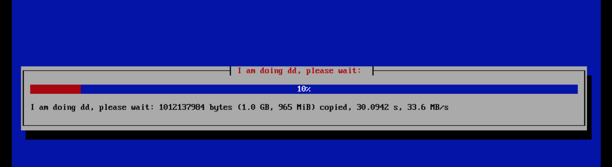
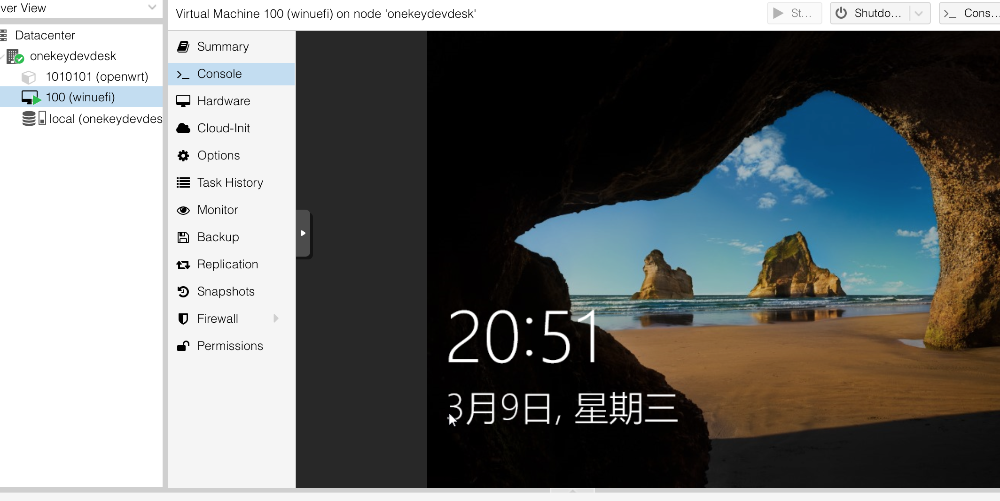

中文 | [英语](/_pages/intro/en/)

省事一键DD云虚拟机云pve云桌面云黑群晖云黑苹果云盘伴侣(带镜像有演示)
=====

onekeydevdesk是一套"通过整合和内嵌vm管理器+openfaas作为透明vfe环境及开发栈"到系统最小核心，及由基于此核心打包的一套多os环境，并相关管理工具和相关脚本，最终组合实现的一套"一键开发桌面理念"系统。  

 * 作为onekeydevdesk的安装脚本部分，1keydd支持扩展多机型安装，支持自打包，自托管，可将你对应机型包括镜像在内的整个DD方案构建为一个可供DD安装的在线仓库,甚至ddhub 
 * 作为onekeydevdesk的多OS部分核心，基于pve，onekeydevdesk实现了一套透明ve,在本机内：支持单显卡核显输出在主从机间自由切换交还，在本机外：支持本机和云主机同 os 组 mate （设置多个转发器，无缝局域网发现，共享与复制文件）类似本地多虚拟机体验    

> onekeydevdesk也指代：1keydd,1keydiskdump,1keydeepindsm,1keydebiandesk,1keydevdeploy,1keydebugdemo,1key desk dock,1key datacenter and desk,1key dir disk,etc ..

项目地址：https://github.com/minlearn/onekeydevdesk 

演示
-----

1keydd支持进度显示（ 视频演示：https://www.bilibili.com/video/BV1ug411N7tn/ ）  
支持包括[az](../../_pages/ddexpandcicustom/az/),[servarica](../../_pages/ddexpandcicustom/sr/),[oracle,oracle arm](../../_pages/ddexpandcicustom/orc/),[ksle](../../_pages/ddexpandcicustom/ks/),[bwg10g512m](../../_pages/ddexpandcicustom/bwglowres/)  

作为onekeydevdesk的多子OS部分，win支持uefi/bios gpt二合一兼容，无视机型差别和无须手动，毫无修改毫无感知地以同一效果运行  

作为onekeydevdesk的多子OS部分，dsm支持直接安装在云主机上，无须嵌套虚拟化

作为onekeydevdesk的多子OS部分，osx使用标准全套kvm驱动和bios机型配置，需要安装在支持嵌套虚拟化的2C2G以上云主机上（1c1.5g/2c2g给osx, 2c2g/3c3g给osx母鸡留1c1g最好），与本地组matedesk，win11类同。

作为onekeydevdesk的工具部分，1keydirdisk支持直接文件浏览器列目录方式做网盘直链

下载安装及用法
-----

以下尽量在debian系linux云主机vnc界面下或本地虚拟机下完成,centos不推荐  
对于intel64结构，下面命令全都适用，对于arm64架构，仅部分命令适用  

基本用法:  

 * 简单前端交互模式  
`wget -qO- 1keydd.com/inst.sh | bash`   

 * 安装其它目标os镜像：deb是纯净debian10,自定义镜像是你的raw系统硬盘格式经过gzip打包后托管的http/https地址  
`wget -qO- 1keydd.com/inst.sh | bash -s - -t deb或自定gz镜像`  

更多用法:  

 * 指定静态网络配置  
`wget -qO- 1keydd.com/inst.sh | bash -s - -n IPV4:youripv4,MASK:yourmask,GATE:yourgateway -t deb或自定gz镜像`  

 * 进入nc+dd模式：提供port:blkdevname参数形式将作为服务器接收端，提供blkdevname:ip:port参数形式将作为客户发送端  
`wget -qO- 1keydd.com/inst.sh | bash -s - -t port:blkdevname或blkdevname:ip:port`  

 * 进入救援模式,ip:5900 vnc访问，无须-t  
`wget -qO- 1keydd.com/inst.sh | bash -s - -d`  

安装后，/run/initramfs/usr/bin/growpart /dev/vda(sda) 2,resize2fs /dev/vda(sda) 2扩展磁盘空间,root密码1keydd，https://xxx:8006为pve口，pve用户名root密码1keydd，vnc客户端连接你机器的ip:8059，密码为1keydd，二个lxc box的端口情况在各自的summary页有写，默认密码都是root/1keydd，如果是云主机建议开放8000-8100这些端口  

onekeydevdesk lxc os镜像在pve的storage->ct templates页可找到，gitee或github，不做说明的情况下，qemu版osx和dsm镜像并不提供开放托管和安装。 

更多文档与演示
-----

更多请看项目文档库[《更多特点介绍和自助安装使用文档》](../../_pages/docs/)部分和hub部分

服务
-----

免费
 * 只提供inst.sh，可一站式解决你DD中大部分问题，去上面仓库，一键DD即可  
`注：仅拥有inst.sh dd能力`  

收费  
 * 项目1：获取osx或win11的系统镜像和安装服务一次（100元,usdt 15）  
 * 项目2：加入付费dd群获取ci.sh脚本源码和1G资源享免费咨询技术支持1年（100元,usdt 15）  
 * 项目1+2：获取一份镜像并同时加入收费群获取源码ci.sh (150元,usdt 25)  
`注：拥有ci.sh扩展驱动/机型能力和自托管能力`  
`加如下作者个人TG：简单说明需求或说明来意即可`     

[minlearn_1keydd](https://t.me/minlearn_1keydd)

捐助
 * 打赏我虚拟币：TRX/USDT/BTC/ETH: [TZ6YPtsojLCJEifNpwm38mmiq7T2gkhGKj](https://trx.tokenview.com/cn/address/TZ6YPtsojLCJEifNpwm38mmiq7T2gkhGKj)    
`怎么捐助: 用支持tron链的钱包APP扫描下列二维码`  

-----

此项目关联 https://github.com/minlearn/minlearnprogramming/tree/master/p/onekeydevdeskopen/ ，它是为配合我在《minlearnprogramming》最小编程/统一开发的想法的一个支持项目。  
本项目长期保存

